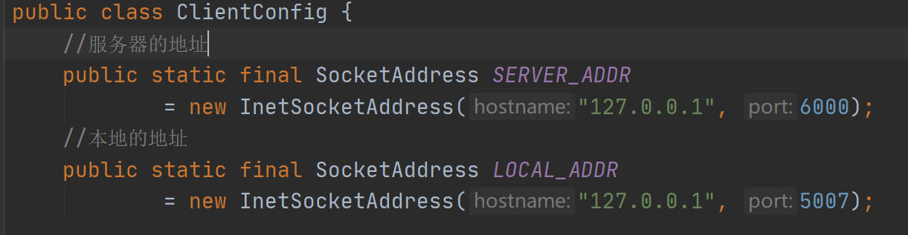
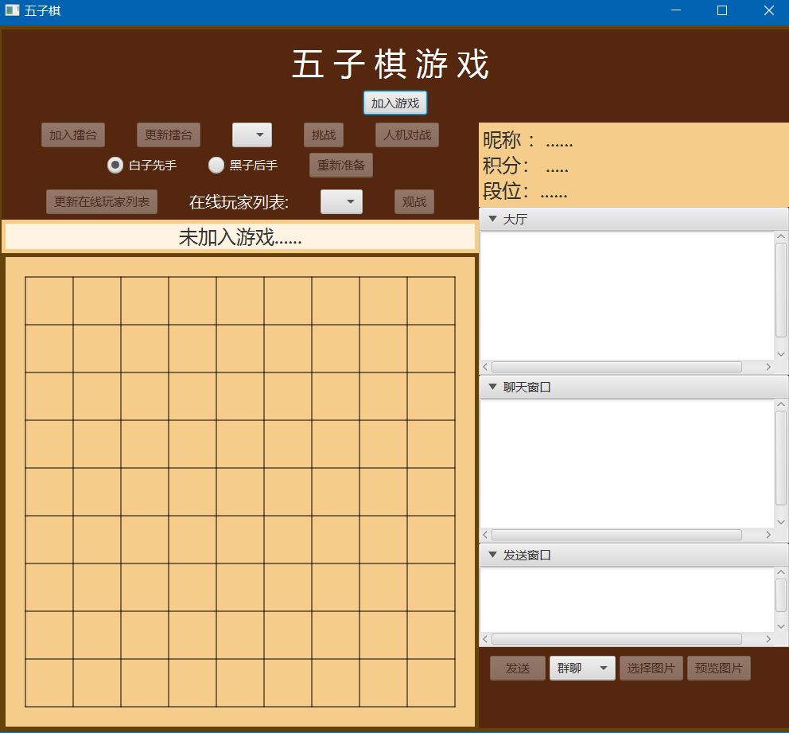
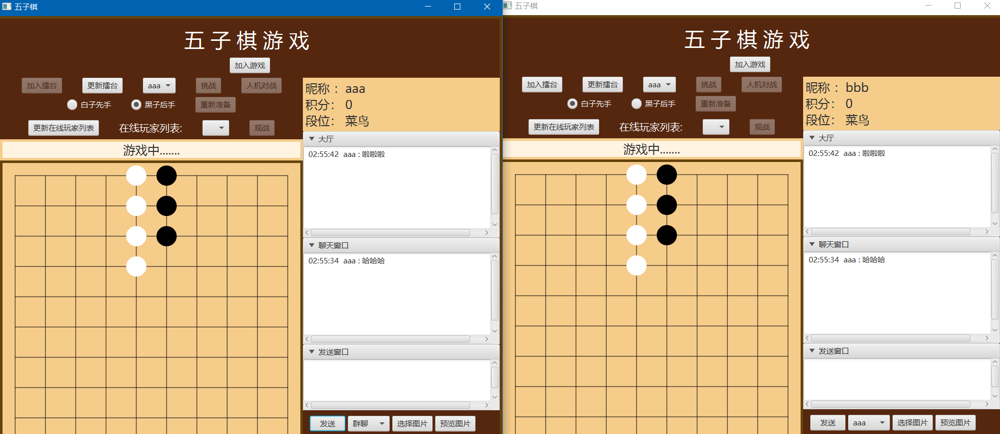
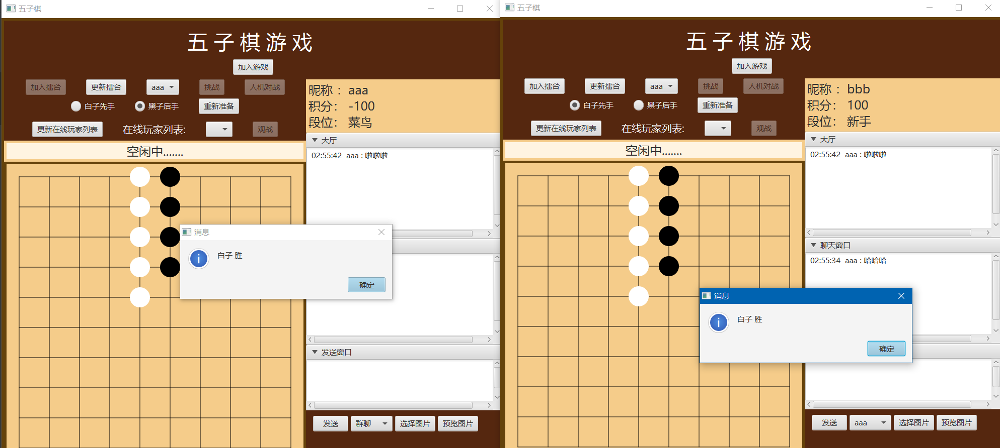

# Chess5_online
基于Java网络编程，实现五子棋对战、有聊天、观战、积分、擂台等功能。
运用网络编程等知识实现功能，才用C/S架构，使用UDP进行数据传输
> ### 效果展示
首先启动服务器Chess5Server，默认本地IP和6000端口

因为在本机调试，所以采用本地IP(127.0.0.1)配置不同端口开启两个客户端来进行对战

配置远程服务器和开启一个客户端并修改端口再开启另一个客户端，得到得到两个五子棋面板

需要加入游戏并加入擂台，另一台客户端更新擂主并挑战擂主，开启下棋，可以实时聊天等

但结束时会有对应的积分统计等

> ### 最后
应该作品为大二时开发的，还有许多功能还没有实现，并且还有许多可以完善的地方，例如求和、悔棋、复盘、发送表情包，图片等功能。程序也有许多未知bug。
